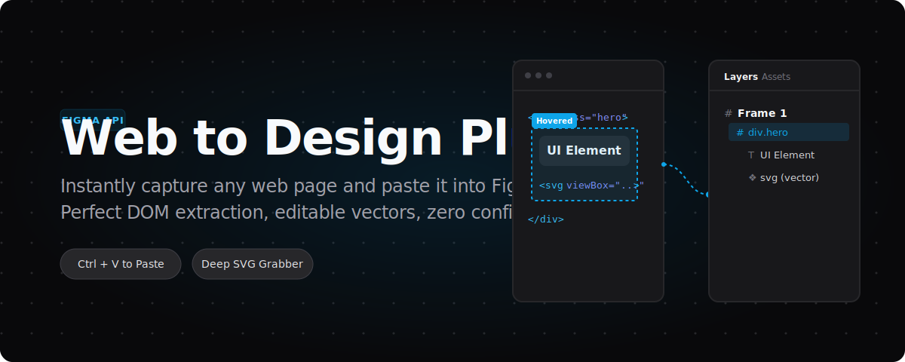

  <strong>English</strong> | <a href="README_CN.md">简体中文</a>

  

Most web-to-design tools require external apps, JSON files, or complex configurations. **Web to Design Plus** is a Chrome extension that captures full web pages or specific DOM elements and instantly writes the structural data to your clipboard.

You simply switch to Figma, press `Ctrl/Cmd + V`, and your web page transforms into a perfect, 100% vector-editable Figma layer tree.

---

## Why it is different

- **Deep SVG & Icon Extraction**: It recursively penetrates same-origin `iframes` and Shadow DOMs. A multi-layer semantic engine intelligently parses CSS classes (like Lucide/FontAwesome), internal SVG tree IDs (`<mask id="...">`), and adjacent text context to automatically name your icons.
- **Font Audit & Sniffing**: Hover over any text to reveal its typography (Font Family, weight, size, line-height, spacing, and color) and copy precise CSS rules. It automatically sniffs loaded font files (woff2, woff, ttf) for one-click local downloads.
- **Zero Config Workflow**: No `.json` file downloads. No backend server required. Data is directly formatted to the clipboard in real-time.
- **Auto Image Proxy**: Automatically resolves CORS-restricted images via Service Worker background fetching with an 8-concurrency limit to prevent dropped assets.

## How to use

1. Download the latest `web-to-design-plus.zip` from [GitHub Releases](https://github.com/amasun/web-to-design-plus/releases) and extract it.
2. Open Google Chrome, go to `chrome://extensions/`, enable **"Developer mode"**, and click **"Load unpacked"** to select the extracted folder.
3. Open any webpage and click the extension icon to reveal the floating toolbar.
4. Select **Entire screen** or **Select element**.
5. Once you see `Copied to clipboard`, press `Ctrl/Cmd + V` in Figma.

## Roadmap & Architecture

This project is actively maintained. The next major update (**v1.1**) focuses on a **Global SVG Sanitizer**:
- **True Icon Font Conversion**: Deep parsing of loaded web fonts (TTF/WOFF) to extract glyph vectors for icon fonts, translating them directly into real SVGs. (See [v1.1 Plan](./docs/v1.1-icon-font-plan.md)).
- **Component Code Export**: Direct export to React (JSX) / Vue components with Tailwind CSS utility classes.

The core runtime uses a reverse-engineered capture engine originally sourced from Figma (`mcp.figma.com`). To preserve readability and future upstream compatibility, `capture.js` remains unobfuscated in the source tree.

## Technical Notes

- **Disclaimer**: Provided for learning and productivity use only. Do not use for unauthorized or sensitive content.
- **Acknowledgements**: Special thanks to [Paidax01](https://github.com/Paidax01) for his original open-source project [web-to-figma](https://github.com/Paidax01/web-to-figma).
- **License**: [MIT License](./LICENSE).

   
  

