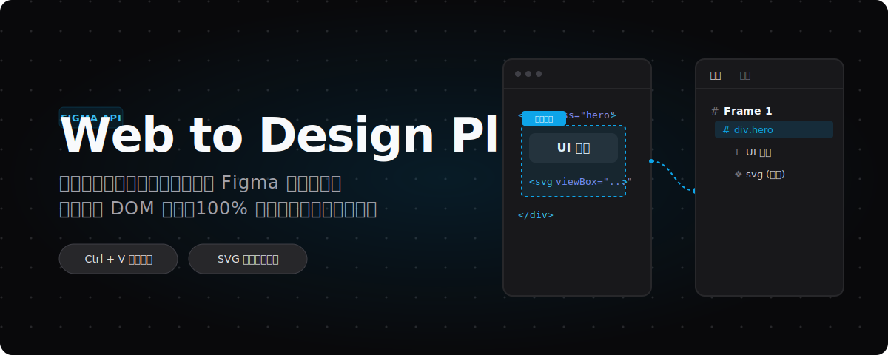

  <a href="README.md">English</a> | <strong>简体中文</strong>

  

绝大多数的「网页转设计稿」工具都需要你下载独立的 App、导出 JSON 文件或者进行繁琐的配置。**Web to Design Plus** 是一款 Chrome 扩展程序，它可以瞬间捕获完整的网页或指定的 DOM 元素，并直接将复杂的结构数据写入你的系统剪贴板。

你只需要切回 Figma，按下 `Ctrl/Cmd + V`，刚才的网页就会立即转化为 100% 可编辑的完美矢量图层树。

---

## 核心优势 (为何与众不同)

- **深度 SVG 与图标穿透提取**：支持递归穿透同源 `iframe` 及 Shadow DOM。内置多重语义探测引擎，能够智能解析 Class 命名规范（如 Lucide / FontAwesome）、SVG 内部 ID 结构（如 `<mask id="...">`）及相邻文本上下文，自动为你捕获的图标精准命名。
- **终极字体审查 (Font Audit)**：只需鼠标悬停，即可透视任何文字的字体家族、字重、尺寸、行高、字距与颜色，并支持一键复制精确的 CSS 样式规则。内置全局 `Fonts List` 审计功能，支持自动嗅探网页加载的字体文件（woff2, woff, ttf）并提供一键本地下载。
- **零配置，即开即用**：**无需下载任何 `.json` 配置文件**，无需架设任何后端服务器。所有数据都在浏览器本地实时处理并直接格式化至剪贴板。
- **自动跨域图像代理**：内置 Service Worker，以 8 并发限制在后台自动抓取和解析跨域受限的图片资源，确保大图与背景不丢失。

## 如何使用

1. 在 [GitHub Releases](https://github.com/amasun/web-to-design-plus/releases) 下载最新版本的 `web-to-design-plus.zip` 并解压。
2. 打开 Chrome 浏览器，进入 `chrome://extensions/`，开启右上角的 **“开发者模式”**，点击左上角的 **“加载已解压的扩展程序”**，选择刚刚解压的文件夹。
3. 访问任意网页，点击浏览器右上角的扩展图标，唤出悬浮工具栏。
4. 选择 **Entire screen**（整页抓取） 或 **Select element**（悬停选择特定元素）。
5. 看到 `Copied to clipboard` 成功提示后，直接在 Figma 中按 `Ctrl/Cmd + V` 粘贴。

## 路线图与架构计划

本项目处于活跃开发中，即将到来的 **v1.1 版本** 核心计划是打造 **全局 SVG 净化器 (Global SVG Sanitizer)**：
- **Icon Font 到真实 SVG 转换**：直接在前端解析网页加载的字体文件（TTF/WOFF），提取 Icon Font 的字形轮廓，100% 转化为真实的 SVG 矢量图层。（详见 [v1.1 实施计划](./docs/v1.1-icon-font-plan.md)）。
- **组件代码导出**：支持将捕获的结构直接导出为 React (JSX) 或 Vue 组件，并自动挂载 Tailwind CSS 类名。

核心的抓取运行时（Runtime）使用了逆向工程的 Figma 官方引擎（`mcp.figma.com`）。为了保证代码的可读性以及未来与官方底层更新的兼容性，`capture.js` 将在源码中永久保持未混淆状态。

## 技术说明与致谢

- **免责声明**：本项目仅供学习、研究以及提升生产力使用。请勿用于抓取或分发未经授权、敏感或非法的网页内容。
- **特别致谢**：感谢 [派大鑫 (Paidax01)](https://github.com/Paidax01) 及其开源的原项目 [web-to-figma](https://github.com/Paidax01/web-to-figma)。本项目在此优秀代码和思路的基础上进行了重构与体验优化。
- **开源协议**：本项目采用 [MIT 许可证](./LICENSE) 开源。

   
  

